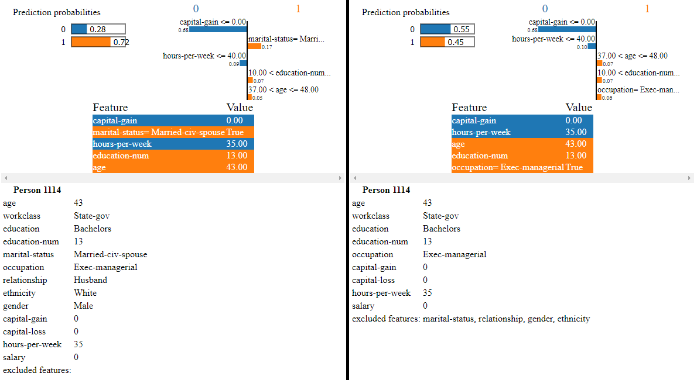
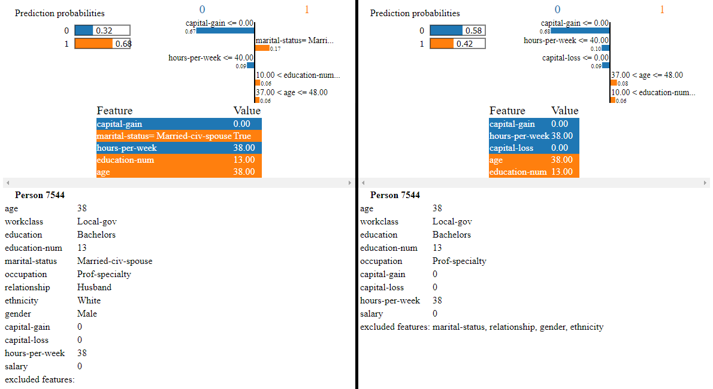
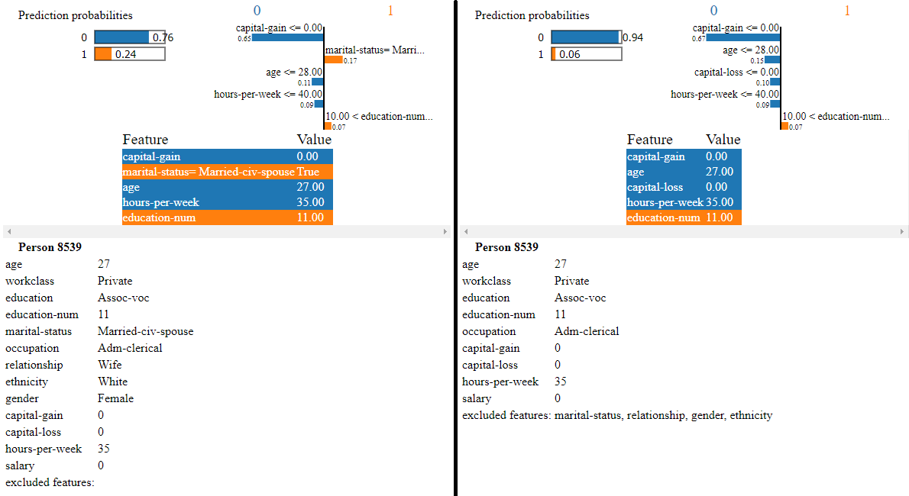

# White-Box vs. Black-Box Model Interpretation

This project consists of one main modules: **interpret_model.py**.

- In *interpret_model.py* all models are being trained and evaluated.

## Prerequisites

- Python: 3.7.4
  - Tensorflow: 1.13.1
  - xai: 0.0.5
  - Scikit-learn: 0.20.1
  - numpy: 1.16.0
  - eli5: 0.10.1
  - pandas: 0.25.3
  - lime: 0.1.1.36

## White-Box Model Interpretation

There are models such as linear regression, decision trees, etc. that have the advantage to be easily interpretable. These models can have properties such as linearity and monotonicity, interactions between its features and are also suitable for different tasks (regression, classification or both).

 * linearity - if the association between features and target is modelled linearly.
 * monotonicity - an increase in the feature value always affects the target outcome in the same way (increase or decrease).

However, these models also have one big disadvantage that predictive performance is lost compared to other machine learning models.

| Algorithm           | Linear | Monotone | Interaction | Task       |
|---------------------|--------|----------|-------------|------------|
| Linear regression   | Yes    | Yes      | No          | regr       |
| Logistic regression | No     | Yes      | No          | class      |
| Decision trees      | No     | Some     | Yes         | class,regr |
| RuleFit             | Yes    | No       | Yes         | class,regr |
| Naive Bayes         | No     | Yes      | No          | class      |
| k-nearest neighbors | No     | No       | No          | class,regr |
(See https://christophm.github.io/interpretable-ml-book/simple.html#simple)

In our code example Logistic Regression and Decision Tree Classifiers are being trained with the [Census Income Data Set](https://archive.ics.uci.edu/ml/datasets/census+income) to predict weather a person makes over 50K a year. Four different models per classifier are being trained - (1.) one with the raw data set without any modifications, (2.) one with two removed features: *marital-status*, *relationship*, (3.) one with the same features removed but a balanced (on *gender*) data set (with [xai](https://github.com/EthicalML/xai) toolbox) and (4.) one more balanced (on *ethnicity*) data set with removed: *marital-status*, *relationship* and *gender*. Then these models are being interpreted using the [eli5](https://github.com/TeamHG-Memex/eli5) library.

### Results

#### Classification report

- **Model 1.** accuracy: 0.8108301770907974
- *Classification report*:

|Model 1.      | precision | recall | f1-score | support |
|--------------|-----------|--------|----------|---------|
| 0            | 0.94      | 0.80   | 0.87     | 7417    |
| 1            | 0.57      | 0.85   | 0.68     | 2352    |
| micro avg    | 0.81      | 0.81   | 0.81     | 9769    |
| macro avg    | 0.76      | 0.82   | 0.77     | 9769    |
| weighted avg | 0.85      | 0.81   | 0.82     | 9769    |

- **Model 2.** accuracy: 0.7800184256321016
- *Classification report*:

| Model 2.     | precision | recall | f1-score | support |
|--------------|-----------|--------|----------|---------|
| 0            | 0.91      | 0.78   | 0.84     | 7417    |
| 1            | 0.53      | 0.77   | 0.63     | 2352    |
| micro avg    | 0.78      | 0.78   | 0.78     | 9769    |
| macro avg    | 0.72      | 0.78   | 0.74     | 9769    |
| weighted avg | 0.82      | 0.78   | 0.79     | 9769    |

- **Model 3.** accuracy: 0.6966666666666667
- *Classification report*:

| Model 3.     | precision | recall | f1-score | support |
|--------------|-----------|--------|----------|---------|
| 0            | 0.66      | 0.81   | 0.73     | 1200    |
| 1            | 0.75      | 0.59   | 0.66     | 1200    |
| micro avg    | 0.70      | 0.70   | 0.70     | 2400    |
| macro avg    | 0.71      | 0.70   | 0.69     | 2400    |
| weighted avg | 0.71      | 0.70   | 0.69     | 2400    |

- **Model 4.** accuracy: 0.7763422337065748
- *Classification report*:

| Model 4.     | precision | recall | f1-score | support |
|--------------|-----------|--------|----------|---------|
| 0            | 0.79      | 0.89   | 0.84     | 2262    |
| 1            | 0.74      | 0.56   | 0.64     | 1221    |
| micro avg    | 0.78      | 0.78   | 0.78     | 3483    |
| macro avg    | 0.76      | 0.73   | 0.74     | 3483    |
| weighted avg | 0.77      | 0.78   | 0.77     | 3483    |

From the classifications reports we could identify some specifics about the four models. Models 1. and 2. show almost equal performance in accuracy, precision and recall. On the other hand, the Model 3. performs slightly worse than the first two and Model 4. has almost the same accuracy as 1. and 2. but shows results on precision and recall closer to Model 3.

- [Precision](https://www.scikit-yb.org/en/latest/api/classifier/classification_report.html) is the ability of a classifier not to label an instance positive that is actually negative -> The precision percent of people that earn >= 50k is higher (less false negatives) in Model 3. and 4. in contrast to the other two models but the precision percent of people that earn < 50k is lower (in 3. and 4.) than the other two models.

- [Recall](https://www.scikit-yb.org/en/latest/api/classifier/classification_report.html) is the ability of a classifier to find all positive instances. Model 4. performs better regarding the recall for people that < 50k (~89% of the people that earn < 50k were truly classified) than the other three models (which show almost the same values). But on the contrary Model 3. and 4. perform worse on the people that earn >= 50k and were truly classified (less false negatives for 1. and 2.).

#### Feature Importance

- Feature importance table for each of the models. *(Weight: Feature)*

| Model 1.                                    | Model 2.                               | Model 3.                               | Model 4.                               |
|:--------------------------------------------|:---------------------------------------|:---------------------------------------|:---------------------------------------|
| +2.318: capital-gain                        | +2.284: capital-gain                   | +2.326: capital-gain                   | +2.242: capital-gain                   |
| +1.516: marital-status__ Married-civ-spouse | +1.007: occupation__ Exec-managerial   | +0.950: occupation__ Exec-managerial   | +1.197: ethnicity__ White              |
| +1.103: relationship__ Wife                 | +0.736: occupation__ Tech-support      | +0.733: occupation__ Tech-support      | +0.992: occupation__ Protective-serv   |
| +0.990: marital-status__ Married-AF-spouse  | +0.722: occupation__ Prof-specialty    | +0.732: occupation__ Protective-serv   | +0.850: occupation__ Exec-managerial   |
| +0.946: occupation__ Exec-managerial        | +0.698: education-num                  | +0.706: education-num                  | +0.762: education-num                  |
| +0.761: education-num                       | +0.681: occupation__ Protective-serv   | +0.691: occupation__ Prof-specialty    | +0.739: occupation__ Tech-support      |
| +0.723: occupation__ Tech-support           | +0.635: age                            | +0.645: age                            | +0.663: age                            |
| +0.701: occupation__ Prof-specialty         | +0.556: workclass__ Federal-gov        | +0.499: workclass__ Federal-gov        | +0.573: workclass__ Federal-gov        |
| +0.667: workclass__ Federal-gov             | +0.465: education__ 5th-6th            | +0.450: hours-per-week                 | +0.503: occupation__ Craft-repair      |
| +0.657: occupation__ Protective-serv        | +0.428: occupation__ Sales             | +0.445: gender__ Male                  | +0.482: hours-per-week                 |
| :    … 19 more positive …                   | :  … 18 more positive …                | +0.427: occupation__ Sales             | :  … 12 more positive …                |
| :    … 27 more negative …                   | :  … 15 more negative …                | :  … 19 more positive …                | :  … 19 more negative …                |
| -0.655: relationship__ Other-relative       | -0.466: ethnicity__ Amer-Indian-Eskimo | :  … 14 more negative …                | -0.539: occupation__ Armed-Forces      |
| -0.663: occupation__ Other-service          | -0.612: education__ Preschool          | -0.515: ethnicity__ Amer-Indian-Eskimo | -0.690: ethnicity__ Black              |
| -0.788: marital-status__ Separated          | -0.650: occupation__ Handlers-cleaners | -0.589: occupation__ Handlers-cleaners | -0.768: occupation__ Farming-fishing   |
| -0.903: gender__ Female                     | -0.705: BIAS                           | -0.818: BIAS                           | -0.882: education__ Preschool          |
| -0.926: occupation__ Farming-fishing        | -0.761: occupation__ Other-service     | -0.833: occupation__ Other-service     | -1.017: occupation__ Other-service     |
| -0.932: BIAS                                | -0.763: occupation__ Armed-Forces      | -0.885: occupation__ Farming-fishing   | -1.041: workclass__ Without-pay        |
| -1.015: marital-status__ Never-married      | -0.910: occupation__ Farming-fishing   | -1.012: workclass__ Without-pay        | -1.087: ethnicity__ Other              |
| -1.024: relationship__ Own-child            | -0.913: gender__ Female                | -1.021: education__ Preschool          | -1.224: ethnicity__ Amer-Indian-Eskimo |
| -1.165: workclass__ Without-pay             | -0.987: workclass__ Without-pay        | -1.263: gender__ Female                | -1.488: BIAS                           |
| -1.641: occupation__ Priv-house-serv        | -1.754: occupation__ Priv-house-serv   | -1.903: occupation__ Priv-house-serv   | -2.512: occupation__ Priv-house-serv   |

> **NOTE:** Features with largest coefficients.
> Caveats:
>
> 1. Be careful with features which are not
   independent - weights don't show their importance.
> 1. If scale of input features is different then scale of coefficients
   will also be different, making direct comparison between coefficient values
   incorrect.
> 1. Depending on regularization, rare features sometimes may have high
   coefficients; this doesn't mean they contribute much to the
   classification result for most examples.

We can now evaluate the feature importance of each model:

- On the one hand we could see that in Model 1. the columns: *marital-status* and *relationship* play an important role in deciding whether a person should earn >= 50k. In my opinion these two columns should not be part of the models and were therefore removed in Models 2., 3. and 4. Looking at other models we could now see that the most important role in deciding whether a person earns >= 50k is played by the columns: *capital-gain*, *occupation* and *education-num*.

- On the other hand we see that in Model 2. a key influencer on deciding whether a person should earn < 50k is the *gender*. The feature *gender__ Female* affects the prediction in a negative way, and, therefore, I have balanced the data set in Model 3. to have equal number of *males* and *females* that earn >= 50k or < 50k (see *support* in the classification report). As we can see in the feature importance column of Model 3., this have not made any positive impact or the negativity of the *gender__ Female* feature. Thus, in Model 4. I have also removed the *gender* column and balanced the model on *ethnicity*.

#### Examples Evaluation

Let us now interpret and evaluate some concrete examples of the test data set.

##### Example 1

| Feature        | Value              |
|----------------|--------------------|
| age            | 33                 |
| workclass      | Private            |
| education      | Assoc-voc          |
| education-num  | 11                 |
| marital-status | Married-civ-spouse |
| occupation     | Sales              |
| relationship   | Husband            |
| ethnicity      | White              |
| gender         | Male               |
| capital-gain   | 0                  |
| capital-loss   | 0                  |
| hours-per-week | 36                 |
| income         | >=50k              |

From my point of view this person should be classified as one earning <50k, bacause of his *age*, *hours-per-week* and *education*. That are also the results of Models 2., 3. and 4. Due to the huge impact of the *marital-status* on the decision, Model 1. has predicted, the otherwise unexpected result, right.

| Model 1. \| y=1 (probability=0.580, score=0.324) | Model 2. \| y=0 (probability=0.576, score=-0.304) | Model 3. \| y=0 (probability=0.561, score=-0.247) | Model 4. \| y=0 (probability=0.646, score=-0.599) |
|:-------------------------------------------------|:--------------------------------------------------|:--------------------------------------------------|:--------------------------------------------------|
| +1.516: marital-status__ Married-civ-spouse      | +0.705: BIAS                                      | +0.842: BIAS                                      | +1.289: BIAS                                      |
| +0.414: occupation__ Sales                       | +0.332: capital-gain                              | +0.311: capital-gain                              | +0.313: capital-gain                              |
| +0.274: education-num                            | +0.260: age                                       | +0.260: age                                       | +0.266: age                                       |
| +0.145: ethnicity__ White                        | +0.148: hours-per-week                            | +0.157: hours-per-week                            | +0.170: hours-per-week                            |
| +0.133: workclass__ Private                      | +0.060: capital-loss                              | +0.057: capital-loss                              | +0.059: capital-loss                              |
| -0.029: gender__ Male                            | -0.026: education__ Assoc-voc                     | -0.033: education__ Assoc-voc                     | +0.051: education__ Assoc-voc                     |
| -0.059: capital-loss                             | -0.060: workclass__ Private                       | -0.062: workclass__ Private                       | +0.034: workclass__ Private                       |
| -0.142: education__ Assoc-voc                    | -0.208: gender__ Male                             | -0.169: ethnicity__ White                         | -0.269: education-num                             |
| -0.153: hours-per-week                           | -0.228: ethnicity__ White                         | -0.271: education-num                             | -0.388: occupation__ Sales                        |
| -0.168: age                                      | -0.251: education-num                             | -0.419: occupation__ Sales                        | -0.926: ethnicity__ White                         |
| -0.337: capital-gain                             | -0.428: occupation__ Sales                        | -0.426: gender__ Male                             |                                                   |
| -0.339: relationship__ Husband                   |                                                   |                                                   |                                                   |
| -0.932: BIAS                                     |                                                   |                                                   |                                                   |

##### Example 2

| Feature        | Value   |
|----------------|---------|
| age            | 47      |
| workclass      | Private |
| education      | HS-grad |
| education-num  | 9       |
| occupation     | Sales   |
| ethnicity      | White   |
| gender         | Female  |
| capital-gain   | 0       |
| capital-loss   | 0       |
| hours-per-week | 52      |
| income         | <50k    |

This example is interesting because only Model 4. classifies it wrong, because the information about the *capital-gain* and *capital-loss* is not convincing and the most valuable feature is the *ethnicity*, which should also have been removed. 

| Model 1. \| y=0 (probability=0.881, score=-2.005) | Model 2. \| y=0 (probability=0.686, score=-0.783) | Model 3. \| y=0 (probability=0.775, score=-1.239) top features | Model 4. \| y=1 (probability=0.541, score=0.163) |
|:--------------------------------------------------|:--------------------------------------------------|:---------------------------------------------------------------|:-------------------------------------------------|
| +0.932: BIAS                                      | +0.913: gender__ Female                           | +1.268: gender__ Female                                        | +0.926:  ethnicity__ White                       |
| +0.903: gender__ Female                           | +0.705: BIAS                                      | +0.842: BIAS                                                   | +0.449:  hours-per-week                          |
| +0.788: marital-status__ Separated                | +0.332: capital-gain                              | +0.311: capital-gain                                           | +0.404:  age                                     |
| +0.337: capital-gain                              | +0.290: education-num                             | +0.291: education-num                                          | +0.388:  occupation__ Sales                      |
| +0.317: education-num                             | +0.060: capital-loss                              | +0.057: capital-loss                                           | -0.009:  education__ HS-grad                     |
| +0.091: education__ HS-grad                       | -0.023: education__ HS-grad                       | -0.061: education__ HS-grad                                    | -0.034:  workclass__ Private                     |
| +0.059: capital-loss                              | -0.060: workclass__ Private                       | -0.062: workclass__ Private                                    | -0.059:  capital-loss                            |
| -0.079: relationship__ Not-in-family              | -0.228: ethnicity__ White                         | -0.169: ethnicity__ White                                      | -0.301:  education-num                           |
| -0.133: workclass__ Private                       | -0.387: hours-per-week                            | -0.405: age                                                    | -0.313:  capital-gain                            |
| -0.145: ethnicity__ White                         | -0.392: age                                       | -0.415: hours-per-week                                         | -1.289:  BIAS                                    |
| -0.253: age                                       | -0.428: occupation__ Sales                        | -0.419: occupation__ Sales                                     |                                                  |
| -0.399: hours-per-week                            |                                                   |                                                                |                                                  |
| -0.414: occupation__ Sales                        |                                                   |                                                                |                                                  |

##### Example 3

| Feature        | Value          |
|----------------|----------------|
| age            | 45             |
| workclass      | Private        |
| education      | Bachelors      |
| education-num  | 13             |
| marital-status | Never-married  |
| occupation     | Prof-specialty |
| relationship   | Not-in-family  |
| ethnicity      | White          |
| gender         | Male           |
| capital-gain   | 0              |
| capital-loss   | 0              |
| hours-per-week | 40             |
| income         | >=50k          |

There are quite a lot of such examples in which Model 1. got the wrong result and Models 2., 3. and 4. guessed it right. In this case we could see that the decision for the person's income to be <50k of the first Model is mainly based on the fact that the person has *never married*. In the other three cases there are not strong indicators for a negative decision.

| Model 1. \| y=0 (probability=0.590, score=-0.363) | Model 2. \| y=1 (probability=0.761, score=1.157) | Model 3. \| y=1 (probability=0.771, score=1.214) | Model 4. \|  y=1 (probability=0.677, score=0.739) |
|---------------------------------------------------|--------------------------------------------------|--------------------------------------------------|---------------------------------------------------|
| +1.015: marital-status__ Never-married            | +0.793:  education-num                           | +0.833: education-num                            | +0.926: ethnicity__ White                         |
| +0.932: BIAS                                      | +0.722:  occupation__ Prof-specialty             | +0.735: occupation__ Prof-specialty              | +0.838: education-num                             |
| +0.337: capital-gain                              | +0.299:  age                                     | +0.426: gender__ Male                            | +0.524: occupation__ Prof-specialty               |
| +0.092: education__ Bachelors                     | +0.228:  ethnicity__ White                       | +0.310: age                                      | +0.308: age                                       |
| +0.059: capital-loss                              | +0.208:  gender__ Male                           | +0.169: ethnicity__ White                        | -0.015: hours-per-week                            |
| +0.029: gender__ Male                             | +0.060:  workclass__ Private                     | +0.062: workclass__ Private                      | -0.034: workclass__ Private                       |
| +0.015: hours-per-week                            | -0.014:  hours-per-week                          | -0.014: hours-per-week                           | -0.059: capital-loss                              |
| -0.079: relationship__ Not-in-family              | -0.040:  education__ Bachelors                   | -0.057: capital-loss                             | -0.148: education__ Bachelors                     |
| -0.133: workclass__ Private                       | -0.060:  capital-loss                            | -0.097: education__ Bachelors                    | -0.313: capital-gain                              |
| -0.145: ethnicity__ White                         | -0.332:  capital-gain                            | -0.311: capital-gain                             | -1.289: BIAS                                      |
| -0.193: age                                       | -0.705:  BIAS                                    | -0.842: BIAS                                     |                                                   |
| -0.701: occupation__ Prof-specialty               |                                                  |                                                  |                                                   |
| -0.864: education-num                             |                                                  |                                                  |                                                   |

##### Example 4

| Feature        | Value              |
|----------------|--------------------|
| age            | 35                 |
| workclass      | Private            |
| education      | Bachelors          |
| education-num  | 13                 |
| marital-status | Married-civ-spouse |
| occupation     | Farming-fishing    |
| relationship   | Husband            |
| ethnicity      | White              |
| gender         | Male               |
| capital-gain   | 0                  |
| capital-loss   | 0                  |
| hours-per-week | 65                 |
| income         | >=50k              |

In this example we see that only Model 2. classified the person's income wrong, bacause of his *occupation* as *Farming-fishing*. Model 3. and 4. have balanced data sets and in Model 1. the prediction was strongly influenced by the *material-status*.

| Model 1. \| y=1 (probability=0.665, score=0.685) | Model 2. \| y=0 (probability=0.526, score=-0.105) | Model 3. \| y=1 (probability=0.516, score=0.063) | Model 4. \| y=1 (probability=0.507, score=0.030) |
|--------------------------------------------------|---------------------------------------------------|--------------------------------------------------|--------------------------------------------------|
| +1.516: marital-status__ Married-civ-spouse      | +0.910: occupation__ Farming-fishing              | +0.880: hours-per-week                           | +0.951: hours-per-week                           |
| +0.864: education-num                            | +0.705: BIAS                                      | +0.833: education-num                            | +0.926: ethnicity__ White                        |
| +0.848: hours-per-week                           | +0.332: capital-gain                              | +0.426: gender__ Male                            | +0.838: education-num                            |
| +0.145: ethnicity__ White                        | +0.167: age                                       | +0.169: ethnicity__ White                        | -0.034: workclass__ Private                      |
| +0.133: workclass__ Private                      | +0.060: capital-loss                              | +0.062: workclass__ Private                      | -0.059: capital-loss                             |
| -0.029: gender__ Male                            | +0.040: education__ Bachelors                     | -0.057: capital-loss                             | -0.148: education__ Bachelors                    |
| -0.059: capital-loss                             | -0.060: workclass__ Private                       | -0.097: education__ Bachelors                    | -0.171: age                                      |
| -0.092: education__ Bachelors                    | -0.208: gender__ Male                             | -0.165: age                                      | -0.313: capital-gain                             |
| -0.108: age                                      | -0.228: ethnicity__ White                         | -0.311: capital-gain                             | -0.673: occupation__ Farming-fishing             |
| -0.337: capital-gain                             | -0.793: education-num                             | -0.835: occupation__ Farming-fishing             | -1.289: BIAS                                     |
| -0.339: relationship__ Husband                   | -0.821: hours-per-week                            | -0.842: BIAS                                     |                                                  |
| -0.926: occupation__ Farming-fishing             |                                                   |                                                  |                                                  |
| -0.932: BIAS                                     |                                                   |                                                  |                                                  |

##### Example 5

| Feature        | Value              |
|----------------|--------------------|
| age            | 55                 |
| workclass      | Private            |
| education      | 10th               |
| education-num  | 6                  |
| marital-status | Married-civ-spouse |
| occupation     | Exec-managerial    |
| relationship   | Husband            |
| ethnicity      | White              |
| gender         | Male               |
| capital-gain   | 0                  |
| capital-loss   | 0                  |
| hours-per-week | 45                 |
| income         | <50k               |

In this example we can see that only Model 4. classified the person's income right, because it was not biased by columns (that otherwise should not play role in the decision) such as: *marital-status*, *relationship*, *gender*.

| Model 1. \| y=1 (probability=0.625, score=0.510) | Model 2. \| y=1 (probability=0.551, score=0.204) | Model 3. \| y=1 (probability=0.560, score=0.241) | Model 4. \| y=0 (probability=0.546, score=-0.183) |
|--------------------------------------------------|--------------------------------------------------|--------------------------------------------------|---------------------------------------------------|
| +1.516  marital-status__ Married-civ-spouse      | +1.007  occupation__ Exec-managerial             | +0.968  occupation__ Exec-managerial             | +1.289  BIAS                                      |
| +0.946  occupation__ Exec-managerial             | +0.764  age                                      | +0.785  age                                      | +1.155  education-num                             |
| +0.494  age                                      | +0.228  ethnicity__ White                        | +0.426  gender__ Male                            | +0.313  capital-gain                              |
| +0.158  hours-per-week                           | +0.208  gender__ Male                            | +0.169  ethnicity__ White                        | +0.139  education__ 10th                          |
| +0.145  ethnicity__ White                        | +0.153  hours-per-week                           | +0.164  hours-per-week                           | +0.059  capital-loss                              |
| +0.133  workclass__ Private                      | +0.060  workclass__ Private                      | +0.062  workclass__ Private                      | +0.034  workclass__ Private                       |
| +0.016  education__ 10th                         | -0.017  education__ 10th                         | +0.010  education__ 10th                         | -0.178  hours-per-week                            |
| -0.029  gender__ Male                            | -0.060  capital-loss                             | -0.057  capital-loss                             | -0.788  age                                       |
| -0.059  capital-loss                             | -0.332  capital-gain                             | -0.311  capital-gain                             | -0.913  occupation__ Exec-managerial              |
| -0.337  capital-gain                             | -0.705  BIAS                                     | -0.842  BIAS                                     | -0.926  ethnicity__ White                         |
| -0.339  relationship__ Husband                   | -1.103  education-num                            | -1.134  education-num                            |                                                   |
| -0.932  BIAS                                     |                                                  |                                                  |                                                   |
| -1.202  education-num                            |                                                  |                                                  |                                                   |

### TODO

- Interpret and evaluate the results of the models trained with a *Decision Tree Classifier* 
> Currently the *Decision Tree Classifier*'s code is commented out.

## Black-Box Model Interpretation

For our black-box interpretations we are going to use [**LIME**](https://github.com/marcotcr/lime). *LIME* explanations are based on *local surrogate models*. These models are interpretable models (like a linear model or decision tree) that are learned on the predictions of the original black box model. But instead of trying to fit a global surrogate model, LIME focuses on fitting local surrogate models to explain why single predictions were made.

(XG-)**Boosting**, in contrast to *Logistic Regression* and *Decision Trees*, takes a more iterative approach. It is an ensemble technique in that many models are combined together to perform the final one, but rather than training all of the models in isolation of one another, boosting trains models in succession, with each new model being trained to correct the errors made by the previous ones.

| AI algorithm class                  | Learning technique     | Scale of explainability (1-5) | Reasoning/Explanation                                                                                                                                                                                                                                                                                                                                |
|-------------------------------------|------------------------|-------------------------------|------------------------------------------------------------------------------------------------------------------------------------------------------------------------------------------------------------------------------------------------------------------------------------------------------------------------------------------------------|
| ...                                 | ...                    | ...                           | ...                                                                                                                                                                                                                                                                                                                                                  |
| Supervised or unsupervised learning | Logistic regression    | 3                             | ...                                                                                                                                                                                                                                                                                                                                                  |
| Supervised or unsupervised learning | Decision trees         | 4                             | ...                                                                                                                                                                                                                                                                                                                                                  |
| Ensemble models                     | Random forest/boosting | 3                             | Random forest techniques operate by constructing a multitude of decision trees during training then outputting the prediction that is the average prediction across all the trees. Even though decision trees are pretty explainable, random forest adds another layer of tree aggregation that makes understanding the final result more difficult. |
| ...                                 | ...                    | ...                           | ...                                                                                                                                                                                                                                                                                                                                                  |
(See [Explainable AI Driving business value through greater understanding, p.24-25](https://www.pwc.co.uk/audit-assurance/assets/pdf/explainable-artificial-intelligence-xai.pdf))

In our code example Random Forest and XGBoost classifiers are being trained with the [Census Income Data Set](https://archive.ics.uci.edu/ml/datasets/census+income) to predict weather a person makes over 50K a year. Two different models per classifier are being trained - (1.) one with the raw data set without any modifications and (4.) one more data set with removed: *marital-status*, *relationship*, *ethnicity* and *gender*. Then these models are being interpreted using the **LIME**.

### Results

#### Classification report

- **Model 1.** accuracy: **0.8626266762206981**
- *Classification report*:

| Model 1.     | precision | recall | f1-score | support |
|--------------|-----------|--------|----------|---------|
| 0            | 0.88      | 0.95   | 0.91     | 7417    |
| 1            | 0.79      | 0.59   | 0.67     | 2352    |
| micro avg    | 0.86      | 0.86   | 0.86     | 9769    |
| macro avg    | 0.83      | 0.77   | 0.79     | 9769    |
| weighted avg | 0.86      | 0.86   | 0.86     | 9769    |

- **Model 2.** (without *marital-status*, *relationship*, *ethnicity* and *gender*) accuracy: **0.8462483365748797**
- *Classification report*:

| Model 2      | precision | recall | f1-score | support |
|--------------|-----------|--------|----------|---------|
| 0            | 0.85      | 0.96   | 0.90     | 7417    |
| 1            | 0.80      | 0.48   | 0.60     | 2352    |
| micro avg    | 0.85      | 0.85   | 0.85     | 9769    |
| macro avg    | 0.83      | 0.72   | 0.75     | 9769    |
| weighted avg | 0.84      | 0.85   | 0.83     | 9769    |

The classification reports for both models look pretty similar. One notices that they perform better than the other models achieving accuracy of more than 84%.

#### Examples evaluation

From the examples' results one notices that *LIME* chooses the five most important features and their importance. Comparing both models it is apparent that the only feature that plays an important role in the predictions, that was removed from *Model 2.*, is *marital-status*. And in some examples this feature plays a crucial role.

In the example above it is easily seen that *material-status* has enough impact to switch the decision from <50k to >= 50k, which in this case generates the wrong answer. Same result for the other two examples.

### TODO

- Interpret and evaluate the results of the models trained with a *Random Forest Classifier* 
> Currently the *Random Forest Classifier*'s code is commented out.
